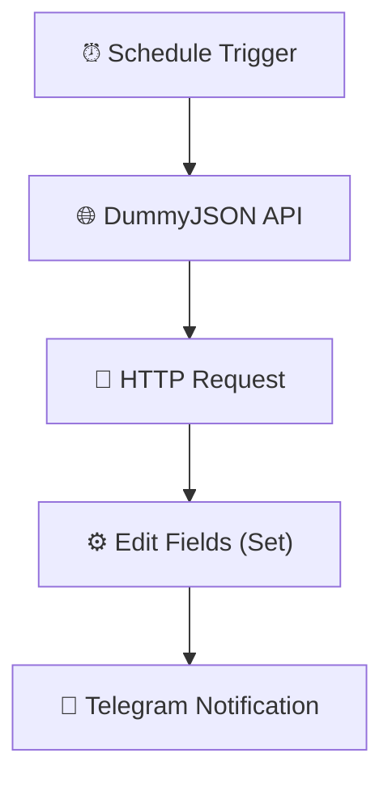

# 🌅 Daily Quote Generator — n8n Automation


An automated daily inspiration workflow built using **n8n**, **DummyJSON API**, **HTTP Request**, and **Telegram Bot API**.

This system automatically retrieves a random inspirational quote from a public API, processes the response data, formats it into a readable message, and delivers a daily motivational quote directly through Telegram.

**Stack:**  
n8n · DummyJSON API · HTTP Request · JSON Processing · Telegram Bot · Workflow Automation


---

# 🎯 Project Overview


## Problem

Maintaining daily motivation and positive habits can be difficult without consistent reminders.

Common challenges include:

- Forgetting to read inspirational content
- Manually searching for daily quotes
- Repetitive content collection
- Lack of automated personal motivation systems
- Manual sharing of inspirational messages


Common scenarios:

- Morning motivation routines
- Personal productivity systems
- Team inspiration messages
- Social media content ideas


---

## Solution

This project creates an automated quote delivery system by:


1. Running a scheduled workflow every day
2. Sending a request to DummyJSON API
3. Retrieving a random inspirational quote
4. Processing API response data
5. Formatting the quote message
6. Adding dynamic date information
7. Sending the final message through Telegram


The workflow acts as a personal digital assistant that automatically delivers daily inspiration without manual interaction.


---

# ✨ Features


## Quote Generation

✅ Automatic random quote retrieval  
✅ Daily inspirational content  
✅ Public API integration  
✅ Dynamic quote delivery  


## API Integration

✅ REST API communication  
✅ HTTP request automation  
✅ JSON response processing  
✅ Free API usage  


## Message Processing

✅ Quote formatting  
✅ Author extraction  
✅ Date generation  
✅ Telegram-ready messages  


## Notifications

✅ Telegram daily delivery  
✅ Automated messaging  
✅ Mobile-friendly format  


## Automation

✅ Scheduled execution  
✅ Fully automated workflow  
✅ No manual triggering required  


---

# 🗺️ System Architecture





---

# 🏗️ Workflow Implementation


# Workflow 1: Daily Quote Delivery Pipeline


## Node 1 — Schedule Trigger


### Purpose

Automatically starts the quote generation workflow at a scheduled time.


Example Configuration:


```text
Trigger:

Every Day


Time:

08:00 AM
```


Execution Flow:


```text
Scheduled Time

      ↓

Retrieve Quote

      ↓

Send Telegram Message
```


---

# Node 2 — HTTP Request


### Purpose

Retrieves a random inspirational quote from DummyJSON API.


Configuration:


```text
Method:

GET


Authentication:

None
```


API Endpoint:


```text
https://dummyjson.com/quotes/random
```


Captured Information:


| Field | Description |
|---|---|
| Quote | Inspirational message |
| Author | Quote creator |
| ID | Quote identifier |


Example Response:


```json
{
"quote":
"Success is not final, failure is not fatal.",

"author":
"Winston Churchill"
}
```


---

# Node 3 — Edit Fields (Set)


### Purpose

Transforms API response data into a formatted Telegram message.


Processed Data:


| Field | Description |
|---|---|
| Quote | Inspirational content |
| Author | Quote source |
| Date | Current date |
| Message | Final Telegram format |


Processing:


```text
DummyJSON Response

        ↓

Formatted Quote Message

        ↓

Telegram Delivery
```


Example Output:


```text
🌅 Good Morning!


💬 Daily Inspirational Quote


"Success is not final, failure is not fatal: it is the courage to continue that counts."


— Winston Churchill


📅 July 01, 2026


Have an amazing day! 🚀


🤖 Generated automatically with n8n.
```


---

# Node 4 — Telegram Notification


### Purpose

Send the generated inspirational quote directly to Telegram.


Example:


```text
🌅 Good Morning!


💬 Daily Quote


"Believe you can and you're halfway there."


— Theodore Roosevelt


📅 July 01, 2026


🚀 Have a productive day!
```


---

# 🔐 Credentials Required


| Service | Purpose |
|---|---|
| Telegram Bot API | Send quote notifications |
| n8n Instance | Workflow execution |


Note:

DummyJSON API does not require authentication.


---

# ⚙️ Setup Guide


## 1. Configure Schedule Trigger


Set your preferred delivery time.


Example:


```text
Every Day

08:00 AM
```


---

## 2. Configure DummyJSON API Request


Add API endpoint.


Required:


```text
API URL

GET Method
```


Example:


```text
https://dummyjson.com/quotes/random
```


---

## 3. Configure Edit Fields Node


Customize the generated message.


Available fields:


```text
Quote

Author

Date

Custom Message
```


---

## 4. Configure Telegram Bot


Steps:


1. Create Telegram bot using BotFather
2. Copy bot token
3. Add Telegram credentials in n8n
4. Configure chat ID


---

## 5. Import Workflow


Import:


```text
workflow.json
```


Configure:


- Schedule time
- Telegram credentials


Activate workflow.


---

# 🧪 Testing Checklist


| Test Case | Expected Result |
|---|---|
| Schedule executes | Workflow starts |
| HTTP Request runs | Quote retrieved |
| API response received | JSON processed |
| Edit Fields executes | Message formatted |
| Telegram executes | Quote received |


---

# 📁 Repository Structure


```text
Daily-Quote-Generator-n8n/

│
├── README.md
│
├── workflow.json
│
├── screenshots/
│
│   ├── workflow.png
│   ├── schedule-trigger.png
│   ├── http-request.png
│   ├── edit-fields.png
│   ├── telegram-output.png
│   └── workflow-execution.png
│
└── LICENSE
```


---

# 📸 Screenshots


Recommended screenshots:


* Complete workflow
* Schedule Trigger configuration
* DummyJSON API response
* HTTP Request node
* Edit Fields message formatting
* Telegram quote output
* Workflow execution result


---

# 🚀 Future Improvements


| Feature | Implementation |
|---|---|
| Multiple Quote Sources | Add more quote APIs |
| Google Sheets Logging | Save quote history |
| AI Quote Generation | Generate custom quotes |
| Category Selection | Motivation, success, productivity |
| Social Media Posting | Auto-post quotes |
| Email Delivery | Send daily emails |
| User Preferences | Personalized quote topics |
| Weekly Reports | Quote summaries |


---

# 🎓 Skills Applied


## Automation

* n8n Workflow Automation
* Scheduled workflows
* Automated messaging systems


## APIs

* REST API Integration
* HTTP Requests
* JSON API Processing


## Data Processing

* JSON transformation
* Data formatting
* Dynamic content generation


## Integrations

* Telegram Bot API
* DummyJSON API


## Business Automation

* Productivity automation
* Notification systems
* Content delivery workflows


---

# 📚 Learning Objectives


This project demonstrates:


* Building scheduled automation workflows
* Integrating public REST APIs with n8n
* Processing JSON API responses
* Creating automated messaging systems
* Formatting dynamic content
* Building lightweight productivity tools


---

# 🙌 Acknowledgements


* n8n
* DummyJSON API
* Telegram Bot API


---

# 👨‍💻 Author


**Belio C. Sinangote**

BS Information Technology Student  
Cebu Technological University (CTU)


GitHub:

https://github.com/belioautomation


This project is part of my **30-Day n8n Automation Portfolio**, showcasing practical automation solutions using **n8n, APIs, Telegram integrations, and workflow automation**.


---

# 📄 License


MIT License
